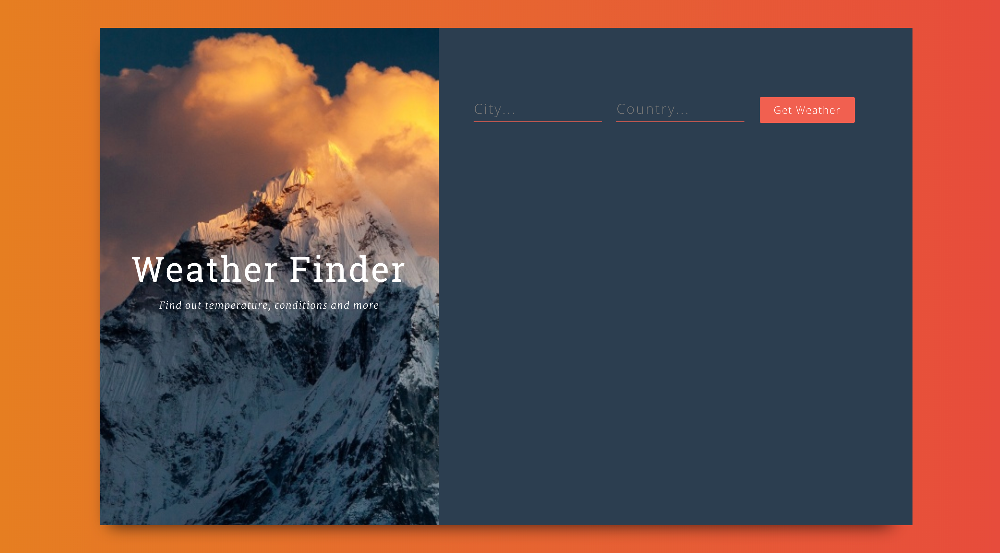
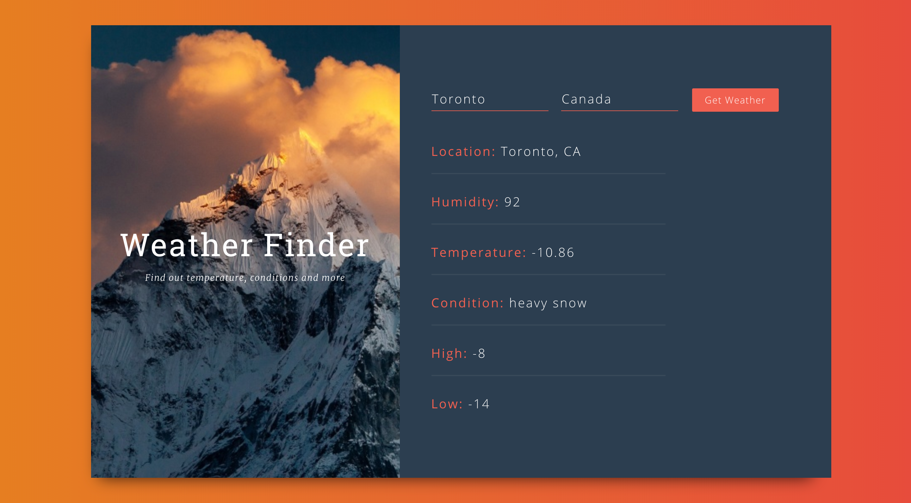
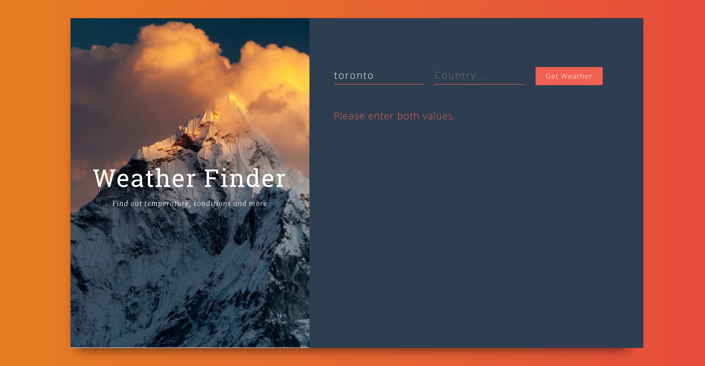

# react-weather-app
A react app which displays the weather.

This app will be taking two values from the user : 

-- City
-- Country

Data regarding the values entered by the user is pulled from the AJAX request and displays the following:

- Location
- Hunidity
- Temperature
- High & Low Temps
- condition (description)

*IF USER LEAVES 1 OR MORE FIELDS BLANK, THE APP WILL RETURN AN ERROR MESSAGE.

<h2>Images:</h2>

<em>Index Page</em>

<em>Search Page</em>

<em> error page </em>

<h2>To run this app </h2>
<em>To run development mode do the following commands into terminal: </em>
 

`npm i`
 
`npm dev` 

